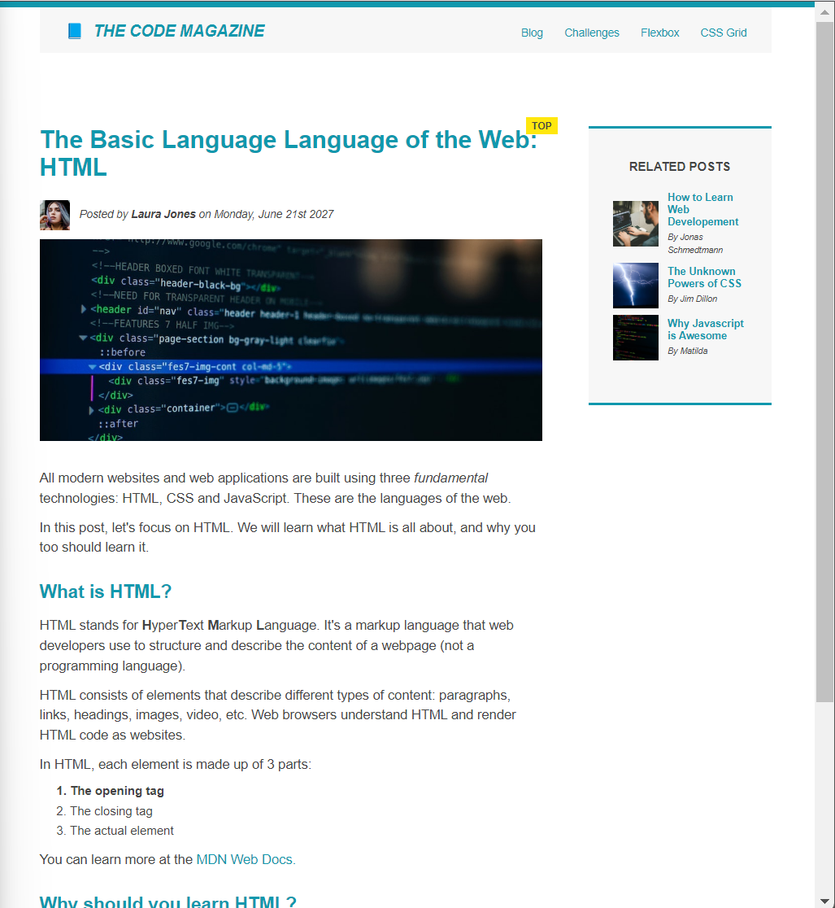

### 👋 **I am Erhan ERTEM**

&emsp;

## Udemy Build Responsive Real-World Websites with HTML and CSS by Jonas Schmedtmann

### **Objective:** Create a blog page

-  Exercise on FLOAT and FLEXBOX in CSS

&emsp;

#### [Blog Site](https://blogsite-erhan-ertem.netlify.app)

---

